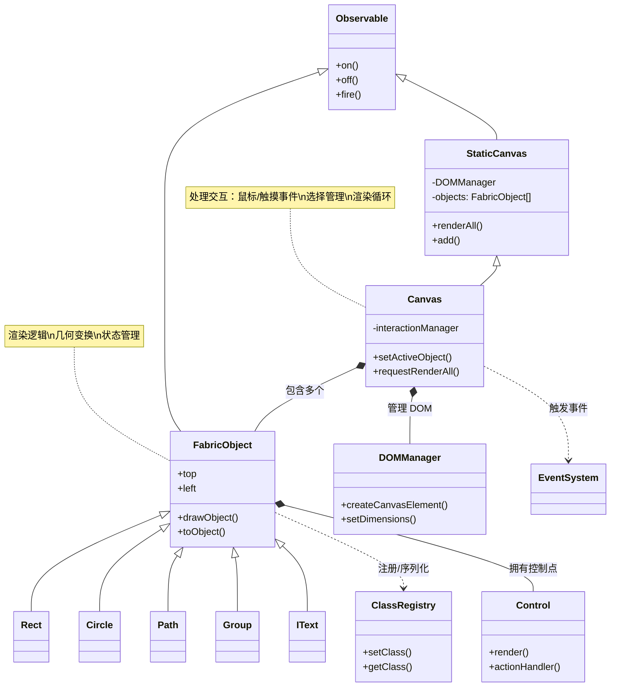

# Fabric.js 项目架构解析

基于 Fabric.js (v7 Beta) 代码库分析，这是一个 **TypeScript 编写的 HTML5 Canvas 交互式图形库**。它主要运行在浏览器端（支持 Node.js 环境渲染）。

以下是针对 Fabric.js 项目生成的架构解释、目录结构及核心思想解析。

## 1. 项目架构图 (Mermaid)

Fabric.js 采用经典的 **面向对象 (OOP)** 与 **事件驱动** 相结合的架构。核心围绕“画布 (Canvas)”与“对象 (Object)”的关系展开，辅以混合模式 (Mixins) 和注册表 (Registry) 机制。



## 2. 目录结构解释

Fabric.js 的 `src` 目录结构清晰地反映了其模块化设计：

```text
src/
├── canvas/                 # 画布核心逻辑
│   ├── StaticCanvas.ts     # 基础渲染层（无交互）
│   ├── Canvas.ts           # 交互层（继承自 StaticCanvas，处理事件、选择）
│   ├── DOMManagers/        # 负责 Canvas 元素的 DOM 操作与样式管理
│   └── SelectableCanvas.ts # 处理对象选择逻辑的中间层
├── shapes/                 # 图形对象实现
│   ├── Object/             # FabricObject 基类
│   ├── Rect.ts             # 矩形
│   ├── Circle.ts           # 圆形
│   ├── Group.ts            # 组合对象
│   └── IText/              # 交互式文本
├── controls/               # 控制点逻辑（缩放、旋转手柄）
│   ├── Control.ts          # 控制点基类
│   └── ...                 # 各种具体的控制逻辑
├── mixins/                 # 混合模式（共享功能模块）
│   └── ...                 # 如滤镜支持、SVG 导出等
├── util/                   # 工具库
│   ├── dom_event.ts        # 事件标准化
│   ├── misc/               # 数学运算、矩阵变换
│   └── ...
├── brushes/                # 自由绘图画笔（Pencil, Spray 等）
├── filters/                # 图像滤镜（WebGL/Canvas2D）
├── ClassRegistry.ts        # 类注册表（用于 JSON 序列化/反序列化）
├── EventTypeDefs.ts        # 强类型事件定义
└── index.ts                # 入口文件
```

## 3. 核心思想解析

Fabric.js 在前端库设计中体现了极高的架构素养：

### 3.1 模块化与分层设计 (Modularity & Layering)

- **分层架构**：
  - **底层 (Util/Math)**：处理矩阵运算、几何计算、DOM 兼容性。
  - **核心层 (Object/StaticCanvas)**：定义了“可渲染对象”和“渲染容器”的标准接口。
  - **交互层 (Canvas/Controls)**：在核心层之上添加了鼠标/触摸事件处理、拖拽、缩放等交互逻辑。
- **职责分离**：`StaticCanvas` 只负责“画”，`Canvas` 负责“动”。这种分离使得在 Node.js 服务端渲染（SSR）时只需加载 `StaticCanvas`，减少了不必要的交互代码开销。

### 3.2 扩展性 (Extensibility)

- **类注册机制 (Class Registry)**：
  - 核心文件 `src/ClassRegistry.ts` 允许开发者注册自定义形状类。
  - **序列化支持**：当调用 `canvas.toJSON()` 时，系统根据注册的类名（如 `type: 'Rect'`）自动序列化；反序列化时通过注册表查找构造函数。这使得第三方插件可以无缝集成到 Fabric 的数据流中。
- **Mixin 模式**：虽然 v6/v7 正在转向组合模式，但 Mixin 仍用于在不同类之间共享复杂功能（如 SVG 导出能力、滤镜能力），避免了深层继承链的僵化。

### 3.3 易维护性 (Maintainability)

- **强类型 (TypeScript)**：v6/v7 完全使用 TypeScript 重写，提供了严格的类型定义（如 `EventTypeDefs.ts`），极大地降低了重构风险和运行时错误。
- **统一的事件系统 (Observable)**：所有的对象和画布都继承自 `Observable`。这意味着无论是画布的 `mouse:down` 还是对象的 `modified`，都遵循相同的订阅/发布模式，降低了学习和调试成本。

### 3.4 可测试性 (Testability)

- **单元测试与视觉测试并重**：
  - **逻辑测试**：针对数学运算、几何变换进行纯逻辑测试（Vitest）。
  - **视觉回归测试**：由于是图形库，项目包含大量视觉对比测试，确保渲染结果在不同版本间的一致性。
  - **环境隔离**：支持在 Node.js (jsdom) 和 浏览器 (Chromium) 环境下分别运行测试，确保跨平台兼容性。

### 3.5 数据流说明 (Data Flow)

1.  **输入**：用户操作（鼠标/触摸）或 API 调用（`canvas.add(rect)`）。
2.  **处理**：
    - **事件层**：`Canvas` 捕获 DOM 事件，转换为 Fabric 内部坐标，判断是否击中对象（Raycasting）。
    - **逻辑层**：更新对象状态（位置、角度、缩放），触发 `object:modified` 等事件。
3.  **渲染**：
    - `requestRenderAll()` 标记画布为“脏”。
    - 在下一个动画帧，遍历 `_objects` 数组。
    - 调用每个对象的 `render()` 方法，将绘制指令发送给 Canvas 2D Context。
4.  **输出**：更新后的 Canvas 视图或导出的 JSON/SVG 数据。
